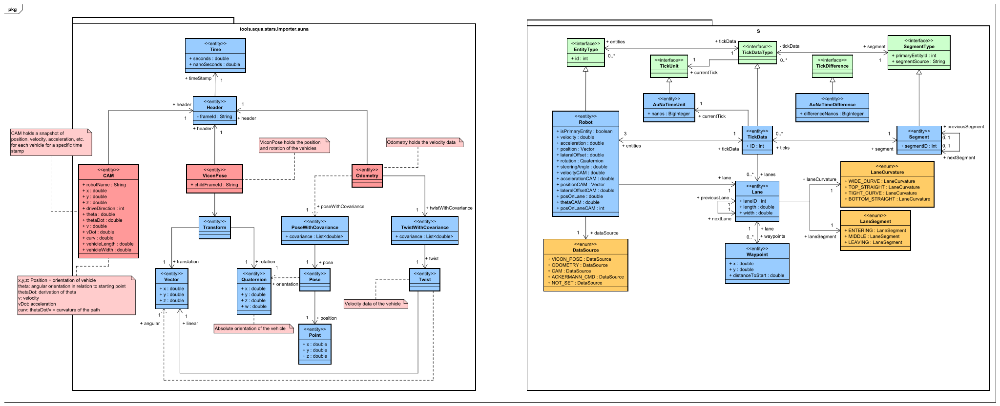

# STARS experiments based on data from model race cars

This repository analyzes driving data recorded using the [STARS
framework](https://github.com/tudo-aqua/stars). The data was recorded using the [AuNa](https://github.com/HarunTeper/AuNa)
Repository.

## Running the Analysis

This project is a Gradle project with a shipped gradle wrapper. To execute the analysis simply execute:

- Linux/Mac: `./gradlew run`
- Windows: `./gradlew.bat run`

## Analysis Results

After the analysis is finished you can find the results in the `analysis-result-logs` sub-folder which will be
created during the analysis.

For each execution of the analysis pipeline a sub-folder with the start date and time ist created. In it, each metric
of the analysis has its own sub-folder. The analysis separates the results of each metric into different categories
with different detail levels.
- `*-severe.txt` lists all failed metric results
- `*-warning.txt` lists all warnings that occurred during analysis
- `*-info.txt` contains the summarized result of the metric
- `*-fine.txt` contains a more detailed result of the metric
- `*-finer.txt` contains all possible results of the metric
- `*-finest.txt` contains all possible results of the metric including meta information

## Meta data information

The scenario data has the following properties:
- `robot width`: 0.2m
- `robot length`: 0.4m
- `track width`: 1.4m (each 0.7m orthogonal from the center)
- `velocity goal`: Depends on the data set, is either 3m/s or 0.8 m/s
- `standstill distance`: 1.25m
- `time distance`: 0.25s
- `target distance at any time`: `standstill distance` + `time distance` * `speed`

## Track overview (Line)


## Track overview (Scatter)


## Track segmentation
As it is visible in the scatter plot above, the straight parts of the track are only mapped by two points.
Therefore, we extracted these 4 coordinates for the two straights. We identified the following points:
- (x=-7.09735979561802,y=-1.89133616892839) (lower left corner)
- (x=2.93225065116357, y=-3.27073098672295) (lower right corner)
- (x=-6.09016702472381,y=3.17436982808834) (upper left corner)
- (x=2.7643231790252, y=4.33303506387608) (upper right corner)

## Domain Model
Here you can find the domain model that is used for this experiments.
All interfaces marked in green come from the [STARS
framework](https://github.com/tudo-aqua/stars) and are implemented with concrete classes in this repository.
The left-hand part of the diagram displays the structure of the messages
that are sent by the platooning vehicles. The right-hand part of the diagram
shows all classes that are necessary for our analysis.



#### (Optional) Git Hooks
If you want to use our proposed Git Hooks you can execute the following command:
```shell
git config --local core.hooksPath .githooks
```